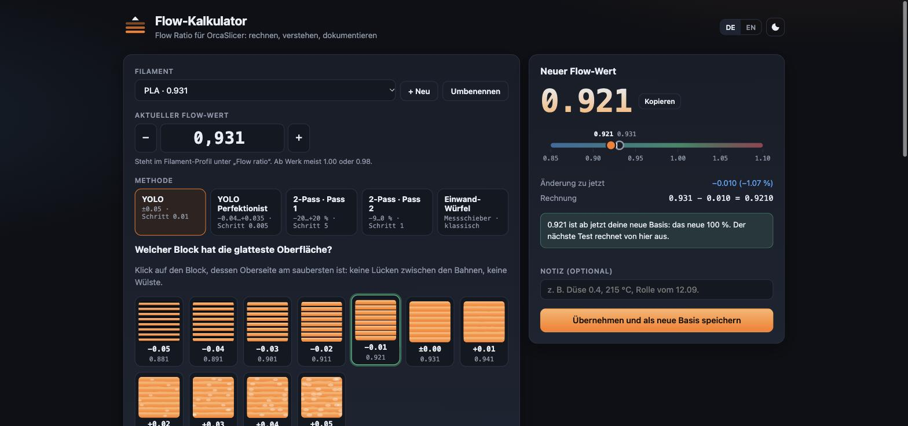

<div align="center">



<h3>Flow ratio calculator for OrcaSlicer: calculate, understand, document.</h3>

<p>
  <a href="https://extrutex.github.io/Flow-Kalkulator-Tool/"></a>
  <a href="https://ko-fi.com/3dw_sebastianwindt"></a>
</p>

<p>
  <a href="https://github.com/Extrutex/Flow-Kalkulator-Tool/actions/workflows/test.yml"></a>
  
  
  
  <a href="LICENSE"></a>
</p>



</div>


You printed the flow calibration blocks in OrcaSlicer and picked the smoothest
one. What is the new value? And what happens on the *next* calibration, once
`1.00` has become `0.95`?

Flow-Kalkulator does the arithmetic, shows each step, and keeps a per-filament
history. Every applied value becomes the new baseline, the new 100 %.

## ✨ Features

- **All OrcaSlicer flow methods**

  | | Method | Blocks | Range |
  |---|---|---|---|
  |  | recommended | 11 | −0.05 … +0.05 |
  |  | fine steps | 16 | −0.04 … +0.035 |
  |  | legacy, pass 2 follows pass 1 | 9 + 10 | −20 … +20 %, then −9 … 0 % |
  |  | calipers, classic | any | your readings |
- **Classic single-wall cube** (calipers): enter the line width set in the slicer
  and as many wall readings as you like. You get mean, spread and standard deviation,
  an exaggerated wall cross-section and a dot plot of your readings.
- **Clickable block grid** with illustrated top surfaces, from under-extruded (gaps)
  to over-extruded (ridges). Each block shows the exact flow ratio it was printed with.
  Arrow keys step through the blocks.
- **Worked calculation** for every result, e.g. `0.931 × (100 − 3) / 100 = 0.9031`.
- **Plausibility checks**: warns on values outside 0.80–1.15, on jumps larger than 8 %,
  when the best block sits at the edge of the test range, and when caliper readings
  vary by more than 0.03 mm.
- **Calibration history per filament**: chart and table with the change per step
  and in total. Undo, CSV export (semicolon separated, opens directly in German Excel)
  and a printable protocol.
- **"Why the new 100 % matters"**: interactive comparison of additive and percent
  corrections for any baseline.
- German and English, dark and light theme, works on phones.
- **No build step, no dependencies, no tracking.** Data stays in your browser (`localStorage`).


## 🧮 Formulas

| | Method | New flow ratio |
|---|---|---|
| 🟣 | YOLO / YOLO Perfectionist | `old + modifier` |
| 🟠 | 2-Pass (pass 1 and pass 2) | `old × (100 + modifier) / 100` |
| 🩷 | Single-wall cube | `old × line_width / measured_wall` |

Slicer formulas and block ranges follow the
[OrcaSlicer wiki: Flow ratio calibration](https://github.com/OrcaSlicer/OrcaSlicer/wiki/flow_ratio_calib).
In OrcaSlicer the flow ratio lives in the **filament** profile.

### Additive vs. percent

At a baseline of `1.00` both readings give the same result. Anywhere else they don't:

| Baseline | Correction | 🟣 YOLO (additive) | 🟠 2-Pass (percent) |
|---|---|---|---|
| 1.00 | −5 | 0.9500 | 0.9500 |
| 0.90 | −5 | 0.8500 | 0.8550 |

So always enter the modifier printed on the block together with the method you
actually printed. The calculator picks the right formula.


## 🔁 Workflow

1. Enter the current flow ratio from your OrcaSlicer filament profile.
2. Pick the method you printed.
3. Click the block with the smoothest top surface, or enter your caliper readings.
4. Copy the new value into the filament profile and save it in OrcaSlicer.
5. Press **Apply and save as new baseline**. The value moves into the history and
   becomes the starting point for the next test.


## 💻 Run locally

Open the hosted version, or serve the folder with any static web server.
ES modules do not load from `file://`.

```sh
git clone https://github.com/Extrutex/Flow-Kalkulator-Tool.git
cd Flow-Kalkulator-Tool
npm start            # python3 -m http.server 8080
# open http://localhost:8080
```

## ✅ Tests

The calculation core (`src/flow.js`) has no DOM dependencies and is tested with
Node's built-in test runner:

```sh
npm test
```

Requires Node 20 or newer. No `npm install` needed.

## 🗂 Project layout

```
index.html         page skeleton
src/flow.js        calculation core (pure functions)
src/charts.js      SVG charts, no chart library
src/app.js         UI state, rendering, persistence
src/i18n.js        German and English strings
src/styles.css     themes and layout
test/              node:test suite for the core
```

## 🚀 Deployment

Every push to `main` runs the tests and publishes the site to GitHub Pages
(`.github/workflows/pages.yml`). In the repository settings, set
**Pages → Source** to **GitHub Actions** once.


## 🇩🇪 Auf Deutsch

**Flow-Kalkulator ist ein kostenloser Flow-Rechner für OrcaSlicer.** Du hast die
Flow-Kalibrierung gedruckt und den glattesten Block gewählt? Der Rechner ermittelt
den neuen Flow-Wert (Flow ratio, Extrusionsmultiplikator) für alle Methoden:

- **YOLO** und **YOLO Perfektionist**: `Flow neu = Flow alt + Modifier`
- **2-Pass** (Pass 1 und Pass 2): `Flow neu = Flow alt × (100 + Modifier) / 100`
- **Einwand-Würfel mit Messschieber**: `Flow neu = Flow alt × Linienbreite / gemessene Wand`

Jeder übernommene Wert wird zur neuen Basis, also zu den neuen 100 %, und landet
im Verlauf des jeweiligen Filaments, mit Diagramm, CSV-Export und druckbarem
Protokoll. Funktioniert auch für Bambu Studio, PrusaSlicer und Klipper-Drucker.
Oberfläche auf Deutsch und Englisch, alle Daten bleiben lokal im Browser.

👉 **[Flow-Kalkulator öffnen](https://extrutex.github.io/Flow-Kalkulator-Tool/)**


## 📄 License

<div align="center">

[GPL-3.0](LICENSE) © Extrutex

If the calculator saved you a spool, you can [buy me a coffee on Ko-fi](https://ko-fi.com/3dw_sebastianwindt). ☕

<sub>Made for people who measure before they guess.</sub>

</div>
